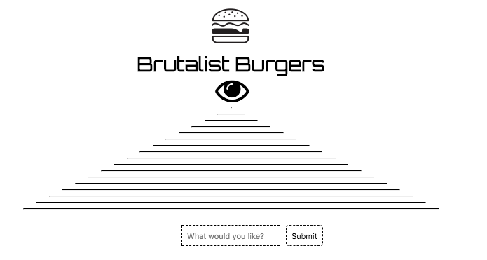
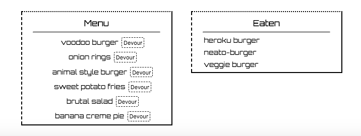

# burger

<h1>Welcome to Brutalist Burgers<h1>

### Summary
***
Brutalist Burgers is a full-stack app which allows users to custom order a menu item of their choosing, as well
as an option to eat the item.

### Technologies Used
***
Brutalist Burgers utilizes Node.js with Express and Handlebars as the view engine, MySQL with a home-baked ORM (configured through JawsDB for Heroku deployment), HTML, CSS, and Vanilla Javascript.

### Comments
***

...

### Screen Shots
***

### Live App
Check out the live app on Heroku:
https://damp-lake-64044.herokuapp.com/